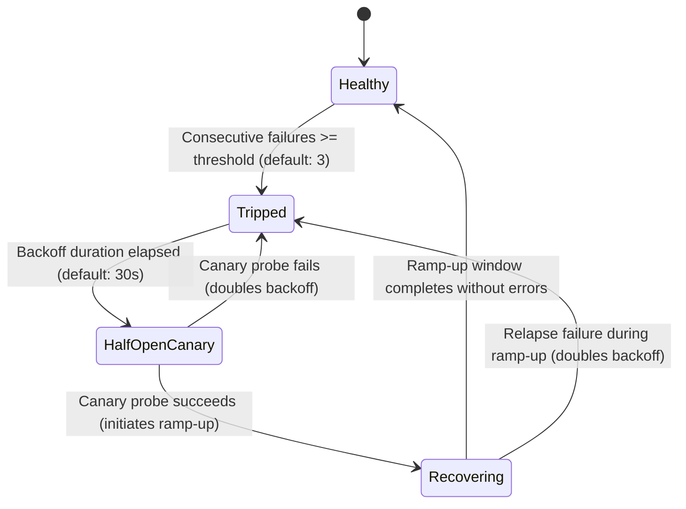

# Synapse Circuit Breakers: Architecture, Protection & Configuration

Synapse 2.0 incorporates a **Dual-Tier Circuit Breaker Architecture** designed specifically to prevent cascading failures, socket starvation, and reconnection storms that plague traditional BitTorrent clients (like Transmission or qBittorrent) when operating under high load or managing tens of thousands of torrents.

---

## 1. Why BitTorrent Clients Need Circuit Breakers

In large-scale BitTorrent environments (especially deployments running 1,000 to 50,000+ swarms):

1. **Dead Tracker Announce Storms (Thundering Herd)**:
   When a popular tracker host suffers an outage, times out, or returns HTTP 5xx errors, thousands of swarms would simultaneously retry announcing to the same dead host. This creates a self-inflicted DDoS against the tracker and consumes local CPU, DNS lookups, and network bandwidth.
2. **Peer Socket & File Descriptor Exhaustion**:
   Swarm discovery (PEX, DHT, Trackers) frequently yields stale or unreachable IP endpoints. In standard clients, continuously re-dialing hundreds of dead peers leads to socket leaks, TCP SYN floods, and libc FD_SET overflows (`FD > 1024`), starving healthy peer connections of system resources.
3. **Event Loop Latency Spikes**:
   Blocking on unresponsive sockets degrades async runtime worker performance, delaying piece processing and disk writes.

Synapse solves this by decoupling failure detection into two isolated, high-performance circuit breakers:
- **Host-Level Tracker Circuit Breaker (`synapse-tracker::CanaryCircuitBreaker`)**
- **Endpoint-Level Peer Circuit Breaker (`synapse-engine::PeerCircuitBreaker`)**

---

## 2. The Circuit Breaker State Machine

Both the tracker and peer circuit breakers implement a **4-state canary & progressive ramp-up model**:



### State Definitions

| State | Behavior | Next Transition |
| :--- | :--- | :--- |
| **`Healthy`** | Normal operation. All outbound dials and announces proceed unimpeded. Every failure increments a consecutive failure counter; any success resets it to 0. | Transitions to `Tripped` if `consecutive_failures >= failure_threshold`. |
| **`Tripped`** | **Complete circuit cutoff**. Outbound dials or announce requests to this endpoint or tracker host are blocked immediately without touching the OS socket layer. | Transitions to `HalfOpenCanary` once `last_failure.elapsed() >= backoff_duration`. |
| **`HalfOpenCanary`** | **Probe verification**. Exactly **one** canary connection or announce is permitted in-flight. All concurrent requests remain blocked waiting for the probe's outcome. | If canary succeeds: transitions to `Recovering`.<br>If canary fails: returns to `Tripped`, doubling `backoff_duration` (`min(backoff * 2, max_backoff)`). |
| **`Recovering`** | **Slow Restore & Progressive Ramp-Up**. Throttles throughput to the recovering host/endpoint via a gradual levee to prevent herd slamming: early phase (1 req / 3s), mid phase (1 req / 1s), late phase (3 req / s). | If ramp-up window (30s) and $\ge 5$ successes complete: promotes to `Healthy`.<br>If *any* failure occurs during recovery: **Fast Relapse Abort** immediately re-trips with doubled backoff. |

---

## 3. Tier 1: Host-Level Tracker Circuit Breaker

The tracker breaker operates on the **canonical hostname** extracted from announce URLs (e.g., `tracker.example.com`).

- **Shared Across All Torrents**: If 10,000 active torrents announce to `http://tracker.example.com/announce`, they share a single circuit state.
- **Failures Triggered By**:
  - Connection timeouts
  - HTTP 500/502/503/504 responses
  - UDP connection handshake timeouts (BEP 15)
  - DNS resolution failures
- **Single Canary Probe**: When the backoff window expires, Synapse permits only **one** torrent to dispatch an announce request to that host.
- **Gradual Ramp-Up & Queue Dispersion**: When the canary succeeds, the host enters `Recovering`. Torrents waiting for this tracker are not blasted simultaneously; instead, excess announces are smoothly scattered across 5–15 second randomized intervals in the min-heap scheduler, preventing thundering-herd spikes on fragile trackers.

---

## 4. Tier 2: Endpoint-Level Peer Circuit Breaker

The peer circuit breaker operates on individual socket endpoints (`SocketAddr: IP + port`).

- **Per-Endpoint Isolation**: If a single peer `198.51.100.42:6881` is offline or firewall-dropping packets, it is isolated without affecting other peers in the swarm or other swarms.
- **Failures Triggered By**:
  - TCP handshake timeouts or connection refused (`ECONNREFUSED`)
  - Protocol handshake errors (invalid BitTorrent header, protocol mismatch)
  - Abrupt connection resets (`ECONNRESET`) during handshake
- **Dynamic In-Flight Update**: Settings can be tuned dynamically while the daemon is running without dropping existing connected peers.

---

## 5. Configuration Reference

### Configuration in `synapse.toml`

Circuit breaker behavior is configured under the `[circuit_breaker]` table in `synapse.toml`:

```toml
[circuit_breaker]
# Enable or disable the peer circuit breaker.
# When disabled, all peer dial attempts proceed directly to the OS socket layer.
# Default: true
enabled = true

# Number of consecutive failures to an endpoint before tripping the breaker.
# Default: 3
failure_threshold = 3

# Initial backoff duration in seconds before the first canary probe is permitted.
# Default: 30
initial_backoff_seconds = 30

# Maximum exponential backoff ceiling in seconds for persistently failing peers.
# Backoff doubles upon each failed canary probe (30s -> 60s -> 120s -> 240s -> 480s -> 600s).
# Default: 600 (10 minutes)
max_backoff_seconds = 600
```

### Environment Variable Overrides

All parameters can be set via environment variables (ideal for Docker and Kubernetes):

| Variable | Type | Default | Description |
| :--- | :--- | :--- | :--- |
| `SYNAPSE_CIRCUIT_BREAKER_ENABLED` | `bool` | `true` | Enable/disable the circuit breaker (`1`, `true`, `0`, `false`) |
| `SYNAPSE_CIRCUIT_BREAKER_FAILURE_THRESHOLD` | `u32` | `3` | Consecutive failure threshold before tripping |
| `SYNAPSE_CIRCUIT_BREAKER_INITIAL_BACKOFF_SECONDS` | `u64` | `30` | Initial backoff duration in seconds |
| `SYNAPSE_CIRCUIT_BREAKER_MAX_BACKOFF_SECONDS` | `u64` | `600` | Maximum backoff ceiling in seconds |

Example Docker invocation:
```bash
docker run -d \
  -e SYNAPSE_CIRCUIT_BREAKER_FAILURE_THRESHOLD=5 \
  -e SYNAPSE_CIRCUIT_BREAKER_INITIAL_BACKOFF_SECONDS=15 \
  -e SYNAPSE_CIRCUIT_BREAKER_MAX_BACKOFF_SECONDS=300 \
  booksarestillbetter/synapse:latest
```

---

## 6. Observability & Monitoring

### Prometheus Metrics

Synapse exposes the circuit breaker health in its Prometheus metrics endpoint (`GET /metrics`):

```prometheus
# HELP synapse_circuit_breakers_tripped Number of currently tripped peer circuit breakers
# TYPE synapse_circuit_breakers_tripped gauge
synapse_circuit_breakers_tripped 14
```

- **Healthy Baseline**: In an active swarm with churn, `synapse_circuit_breakers_tripped` will maintain a small baseline of dead peers that have been safely quarantined.
- **Alerting Guidance**: A sudden surge in `synapse_circuit_breakers_tripped` usually indicates external network degradation, an ISP block, or a mass outage of a VPN endpoint.

### Structured Logging

Synapse logs all circuit breaker lifecycle transitions at `INFO` and `WARN` levels:

```text
2026-09-09T05:40:12.102Z WARN synapse_engine::circuit_breaker: Peer circuit breaker tripped for 198.51.100.42:6881 after 3 consecutive failures. Backing off for 30s.
2026-09-09T05:40:42.105Z INFO synapse_engine::circuit_breaker: Peer circuit breaker for 198.51.100.42:6881 transitioned to HalfOpenCanary. Testing canary connection.
2026-09-09T05:40:42.230Z INFO synapse_engine::circuit_breaker: Canary connection succeeded for peer 198.51.100.42:6881! Circuit Breaker reset to Healthy.
```
